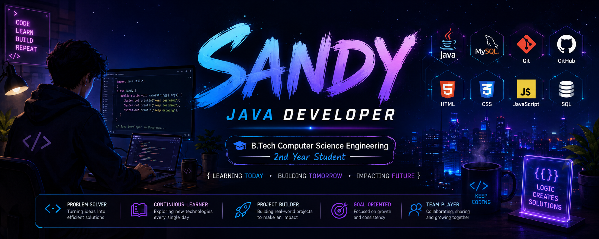

  

# Hi 👋, I'm Sandeep

### ☕ Java Developer | 🎓 B.Tech Computer Science Student

  

---

# 💫 About Me

🎓 **B.Tech Computer Science Engineering (2nd Year)**

💻 Passionate about **Java Development**, **Problem Solving**, and **Software Engineering**

🚀 Currently improving my skills in:

* Java
* Data Structures & Algorithms
* DBMS
* SQL
* JavaScript
* Git & GitHub

🌱 My goal is to become a **Full Stack Java Developer** and contribute to impactful open-source projects.

---

# 🌐 Connect With Me

---

### 💬 Let's Connect!

I'm always interested in collaborating on Java projects, learning new technologies, and connecting with fellow developers.

* 💻 GitHub: **https://github.com/Sandeeptumu**
* 💼 LinkedIn: **https://www.linkedin.com/in/tumu-sandeep-57507a3b0/**
* 📧 Email: **[tumusandeep0000@gmail.com](mailto:tumusandeep0000@gmail.com)**

---

## 💻 Tech Stack

### 👨‍💻 Languages

### 🛠️ Tools

### Currently Learning

---

# 🚀 Featured Projects

### 📚 Student Management System

Java application for managing student information with object-oriented programming principles.

---

### 📊 CSV Data Processing

Reads, filters, and processes CSV data using Java Streams.

---

### 🤖 AI Notes Summarizer

An AI-powered academic project for summarizing notes and improving study efficiency.

---

# 📅 2026 Goals

* ✅ Master Java Core
* 🔄 Learn Spring Boot
* 🔄 Solve 500+ DSA Problems
* 🔄 Build 10+ Real-world Projects
* 🔄 Contribute to Open Source
* 🔄 Earn Java Certifications

---

# ⚡ Fun Fact

> Every expert was once a beginner who never stopped coding.

---

### ⭐ Thanks for visiting my profile!

*"Code. Learn. Build. Repeat."*

